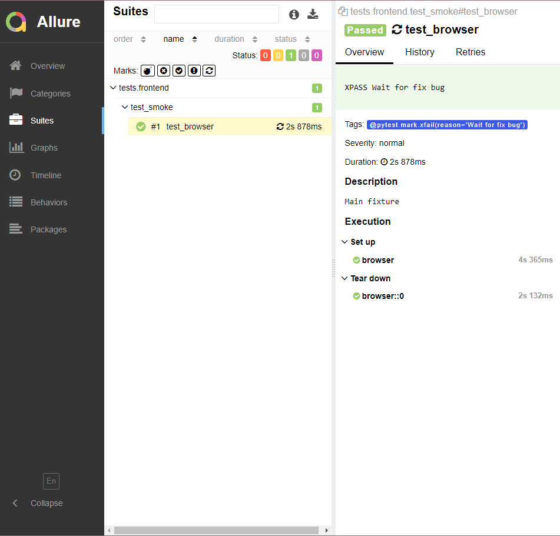
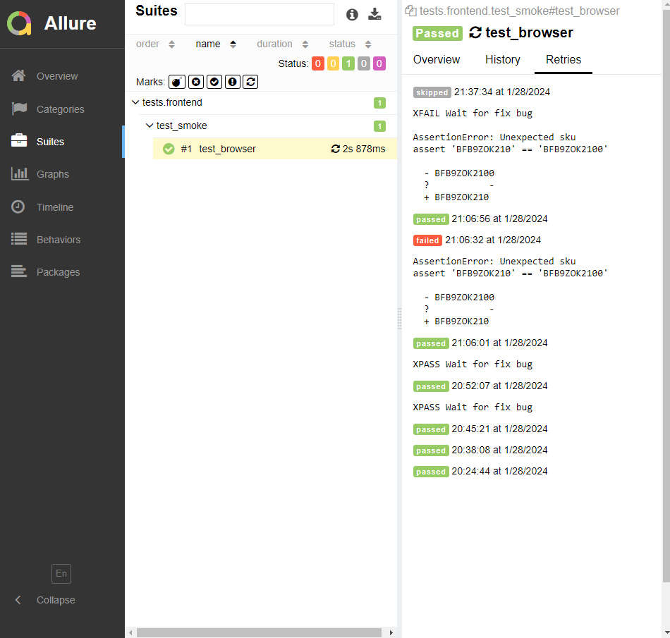

# Пример автотестов на **Python** + **Selenium** + **Allure**

## [Содержание](#Содержание)

[Описание проекта](#Описание-проекта)  
[Технологический стек](#Технологический-стек)   
[Подготовка для запуска тестов](#Подготовка-для-запуска-тестов)  
[Запуск тестов](#Запуск-тестов)  
[Результаты прохождения тестов](#Результаты-прохождения-тестов)

## Описание проекта

Этот проект предназначен для демонстрации работы автотестов для сайта [TestQaStudio](https://testqastudio.me/).
Автотесты написаны на языке **Python** с использованием библиотек **Selenium** и **Allure**.

[Назад к содержанию](#Содержание)

## Технологический стек

<p>
    <a href="https://www.python.org/">
        
    </a>
    <a href="https://www.selenium.dev/">
        
    </a>
    <a href="https://allurereport.org/">
        
    </a>
</p>   

**[Python](https://www.python.org/downloads/)** - язык программирования для написания тестов.

**[Selenium](https://www.selenium.dev/)** - фреймворк для автоматизации веб-приложений в целях тестирования.

**[Allure](https://requests.readthedocs.io/en/latest/)** - инструмент для создания отчета о тестировании проекта.

[Назад к содержанию](#Содержание)

## Подготовка для запуска тестов

Чтобы запустить тесты, необходимо:

- установить **Python**
- установить **Selenium** и **Allure**
- создать и активировать виртуальное окружение.

### Установка **Allure Report**
Установка для разных операционных систем разная:  
**MacOS** выполнить команды:

```bash
   brew install allure
```

**Linux** (на базе Debian)

```bash
    sudo apt-add-repository ppa:qameta/allure
    sudo apt-get update
    sudo apt-get install allure
```

**Windows**: Необходимо скачать [архив по ссылке](https://repo.maven.apache.org/maven2/io/qameta/allure/allure-commandline/2.19.0/allure-commandline-2.19.0.zip)
и положить **распакованный** каталог рядом с проектом.

#### Запуск **Allure Report**

- На **Windows** найти в каталоге *allure\bin* файл *allure.bat* и запустить его выполнение
- На **Linux/Mac** выполнить файл рядом *./allure*

Если при запуске **Allure Report** будет ошибка, связанная с отсутствием каких-то компонент, то необходимо
установить [Java](https://www.java.com/en/download/).

### Создание и активация виртуального окружения
Для создания и активации виртуального окружения необходимо перейти в папку с проектом и в командной строке выполнить
команды:

```Bash
# создание виртуальгого окружения
python -m venv env

# активировация виртуального окружения: 

# команда для Windows
.\env\Scripts\Activate.ps1 
# при возникновении ошибки ввести команды:
Set-ExecutionPolicy -Scope Process -ExecutionPolicy Bypass
.\env\Scripts\Activate.ps1

# команда для Mac и Linux
source env/bin/activate    

# Деактивация окружения
deactivate
```
### Установка необходимых модулей
```bash
    pip install pytest
    pip install selenium
    pip install allure-pytest
```

[Назад к содержанию](#Содержание)

## Запуск тестов

Запуск тестов осуществляется с помощью команды из командной строки **Терминала**:

```bash 
pytest tests/frontend/test_smoke.py
```

[Назад к содержанию](#Содержание)

## Результаты прохождения тестов
Результаты прохождения тестов легко просматривать в автоматически сформированных отчетах **Allure**, какие тесты были пройдены, какие тесты упали.
Если тест упал, можно сразу увидеть, что вызвало падение и на каком этапе.
<p>
    
    
</p>

[Назад к содержанию](#Содержание)

